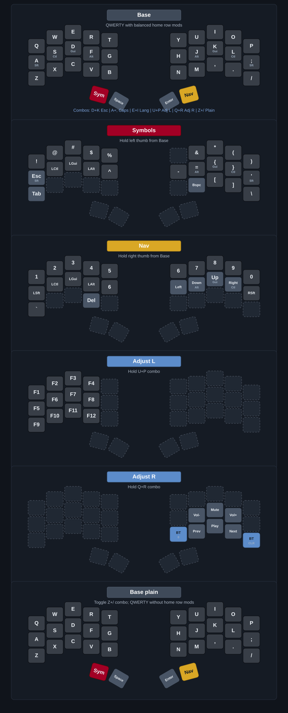

# k4i's split kbd

ZMK firmware for a **Sweep-style cradio** split: **nice!nano v2** + `cradio_left` / `cradio_right`, built from [devpew/swp](https://github.com/devpew/swp). The keyboard name in firmware is `sweep split kbd`.

**CI artifacts:** `sweep_l.uf2` (left), `sweep_r.uf2` (right), `reset.uf2` (Bluetooth reset).

## Quick start

### Flash new firmware

> To build locally without GitHub Actions, see [LOCAL_BUILD_DOCKER.md](LOCAL_BUILD_DOCKER.md).

1. [Fork this repo](https://github.com/briginas/zmk-sweep/fork)
2. (Optional) Edit `config/cradio.keymap` and `config/cradio.conf`.
3. Wait for the GitHub Actions build to finish (**Actions** tab on your fork), then download the **`firmware`** artifact and unzip it.
4. Connect the half you are flashing with a USB cable.
5. Enter the bootloader on that half:
   1. Double-click the reset button
   2. Quickly short the reset button twice (if the button is unreliable)
   3. Quickly short **GND** and **RST** on the controller twice (e.g. second and third pins on the corner row—check your board’s pinout)
6. Copy the matching UF2 to the bootloader drive:

   | File | Half |
   | --- | --- |
   | `sweep_l.uf2` | Left (central, Bluetooth host) |
   | `sweep_r.uf2` | Right (peripheral) |
   | `reset.uf2` | Either — clears Bluetooth pairings when pairing is stuck (not needed for normal keymap updates) |

### Firmware behavior (config)

- Bluetooth: up to five paired profiles (`CONFIG_BT_MAX_PAIRED=5` in `cradio.conf`).
- Battery reporting for both halves (split central can show the peripheral’s level).
- Idle timeout 30 s; **sleep** after one hour of inactivity.
- **Soft off** is enabled in the build; wakeup is wired via GPIO in the keymap (no `&soft_off` binding in the current layer map—see `config/cradio.keymap` if you add one).
- **Pointing** is enabled in Kconfig (`CONFIG_ZMK_POINTING=y`); the current keymap does not define a mouse layer.

## Keymap (overview)

The layout is intentionally **maximally close to a full-size keyboard**: letters follow normal QWERTY, punctuation on **Symbols** mirrors typical US placement, and **Nav** puts numbers and arrows where you would expect on a standard board. Home row mods on **A S D F** / **J K L ;** are the main ergonomic adaptation; **Base plain** keeps the same QWERTY layout without those hold-tap home row mods.

Home row mods use **balanced** hold-tap (`hml` / `hmr`) on the letters **A S D F** and **J K L ;** (Shift / Ctrl / Gui / Alt as labeled in the map).

**Combos:** **Esc**, **Caps Lock**, **Lang** (`LG(SPACE)`), **Adjust L** (`U+P`), **Adjust R** (`Q+R`), and **Base plain** toggle (`Z+/`)—see `combos` in `config/cradio.keymap` for key positions.

  

*Diagram mirrors `config/cradio.keymap` and is generated by `python3 gen_svg.py`. [Editable draw.io copy](https://viewer.diagrams.net/?tags=%7B%7D&highlight=0000ff&edit=_blank&layers=1&nav=1&title=sweep-layout.drawio#Uhttps%3A%2F%2Fraw.githubusercontent.com%2Fbriginas%2Fzmk-sweep%2Fmain%2Fassets%2Fsweep-layout.drawio).*

| Layer          | How you get there               | Role                                                                                                                          |
| -------------- | ------------------------------- | ----------------------------------------------------------------------------------------------------------------------------- |
| **Base**       | Default                         | QWERTY with home row mods; **left thumb** = hold **Symbols**; **right thumb** = hold **Nav**; thumbs share **Space/Enter**.   |
| **Symbols**    | Hold **left thumb** from Base   | Punctuation and symbols; **Tab**; right block includes **Backspace**.                                                         |
| **Nav**        | Hold **right thumb** from Base  | Numbers; arrows and navigation with modifiers on the home row.                                                                |
| **Adjust L**   | Hold **U+P** combo              | Function keys **F1–F12**.                                                                                                     |
| **Adjust R**   | Hold **Q+R** combo              | **BT_SEL 0**, **BT_CLR**, volume, and media keys.                                                                              |
| **Base plain** | Toggle **Z+/ combo**            | QWERTY base layer without home row mods; keeps the same **Symbols**, **Space**, **Enter**, and **Nav** thumbs as **Base**.     |

## References

- [Sweep (hardware)](https://github.com/davidphilipbarr/Sweep)
- [Source keymap walkthrough](https://www.youtube.com/watch?v=VShLPvF693k)
- [ZMK Documentation](https://zmk.dev/docs)
- [ZMK Keymaps & Behaviors](https://zmk.dev/docs/keymaps)
- [nice!nano product page](https://nicekeyboards.com/nice-nano)
- [devpew/swp — config this was built from](https://github.com/devpew/swp)
